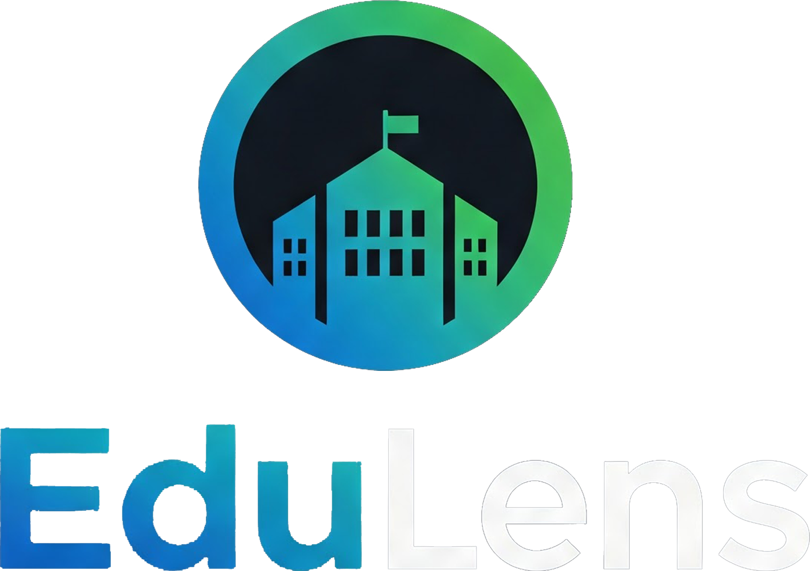

 

<h1 align="center"> Tübitak 4006 B Project EduLens Backend </h1>

This repository contains the backend code for the EduLens project, funded by Tübitak 4006 B.

---

## Project Structure

The backend codebase is organized into the following main directories:

- `docs/`  
  Documentation files and related resources for the EduLens project.

- `api/`  
  REST API implementation handling HTTP requests and routing.

- `ai/`  
  AI and machine learning modules such as face recognition and attendance logic.

- `assets/logos/`  
  Logo images used in documentation and README.

---

## Environment

- **Go version:** 1.22.3  
- **Python version:** 3.10.5

---

## Frontend

The frontend application for EduLens can be found [here](https://github.com/yigitgulmez/Edulens_Frontend).

You can clone and run it separately to interact with the backend.

---

Feel free to explore each directory for more details on their functionality.
